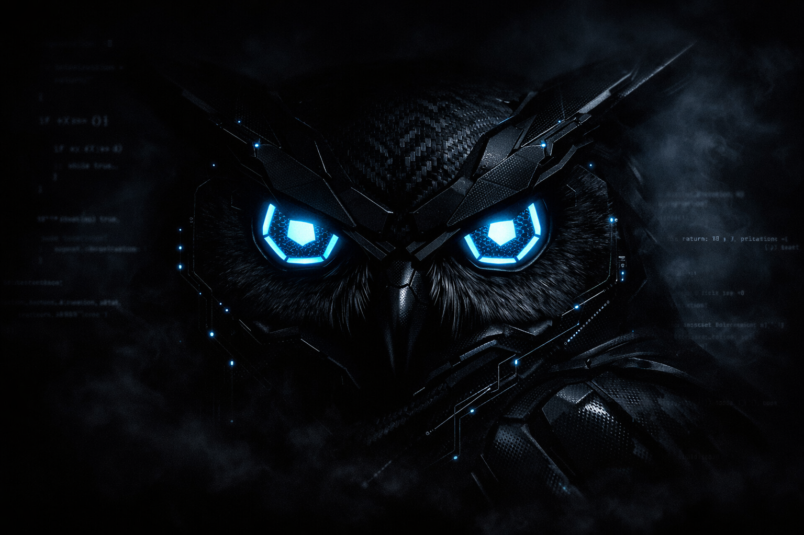

# 🦉 OwlEyeEngine: The Silent Monitor




```text
    ^...^
   / o o \
   |  Y  |   "Silent flight, 360° vision. 
    V v V    The predator the intruder never hears."
```

**OwlEyeEngine** es la evolución de mi proyecto de seguridad, inspirado en la naturaleza del búho: un cazador nocturno, silencioso y letal. Este motor representa mi avance en el monitoreo de bajo nivel, detección heurística y seguridad en infraestructuras críticas.

## 🚀 Mi Visión: El Cazador Silencioso
Desarrollado a las 2 AM, en el silencio de la noche, este motor encarna la vigilancia proactiva. Mi capacidad técnica se centra en:
- **Sigilo Absoluto:** Monitoreo que no deja rastro para el atacante.
- **Detección Heurística:** Inteligencia que reconoce patrones sospechosos antes de que se conviertan en desastres.
- **Enfoque Cisco:** Especializado en la trazabilidad de redes gestionadas.

---

## 🛠️ Capacidades de OwlEye
### 1. Visión 360° (Procesos) 🔍
Un sistema de vigilancia estilo "htop" que captura:
- **Identidad:** PID, usuario y jerarquía de procesos.
- **Origen:** Rutas de ejecución y binarios relacionados.

### 2. Silent Flight (Redes Cisco) 🌐
Detecta incursiones sin alertar al intruso, identificando los "Entry Points" exactos en entornos de red complejos.

### 3. Vuelo Heurístico 🧠
El motor no solo observa, analiza:
- **Port Scanning:** Identificación de barridos de red en tiempo real.
- **Rutas Prohibidas:** Alertas inmediatas para procesos lanzados desde directorios sospechosos (Temp, Hidden).

### 4. Alertas Nocturnas 📱
Integración con **Telegram** para notificaciones críticas enviadas directamente a tu móvil.

---

## 📂 Arquitectura del Motor
- `sentry.py`: El corazón del Búho (OwlEye Core).
- `heuristic_analyzer.py`: El cerebro analítico.
- `network_monitor.py`: Los oídos del centinela.
- `hidden_logger.py`: El diario oculto del cazador.

---

## �️ Tecnologías y Aptitudes (LinkedIn Ready)
Este proyecto integra diversas competencias técnicas esenciales en el ámbito de la Ciberseguridad y el Desarrollo de Software:

- **Ciberseguridad:** Análisis heurístico de amenazas, detección de escaneo de puertos (Port Scanning) y monitoreo de procesos sospechosos.
- **Seguridad en Redes:** Gestión de conexiones TCP/UDP, trazabilidad de "Entry Points" y fundamentos de Networking (Cisco Focused).
- **Desarrollo Multiplataforma:** Arquitectura compatible con Windows y Linux mediante Python.
- **Automatización de Alertas:** Integración de APIs en tiempo real (Telegram Bot API) para respuesta inmediata ante incidentes.
- **Sistemas Operativos:** Manipulación de atributos de sistema (Windows API/Kernel) y gestión de archivos en entornos POSIX (Linux).
- **Python Avanzado:** Uso de librerías de bajo nivel como `psutil` y `ctypes`.

---

## �🗺️ Mi Camino Completado
- [x] Desarrollo de herramientas de monitoreo base (**v1.0**).
- [x] Integración de lógica cross-platform (Win/Linux).
- [x] Implementación de alertas vía Telegram/Slack.
- [x] Análisis de tráfico heurístico (**Owl-Engine v2.0**).
- [ ] Certificación internacional en Redes y Seguridad (Cisco/CCNA) - **Vuelo en curso**.

---

## 🗺️ Mi Camino a la Certificación (Cisco/CCNA)
Proyecto utilizado como laboratorio práctico para los dominios de la certificación:
- **Dominio 5:** Fundamentos de Seguridad (Seguridad de capa 2/3).
- **Dominio 1:** Arquitectura de Red y conectividad IP.

### 📚 Recursos del Cazador:
- [Cisco Networking Academy](https://www.netacad.com/)
- [Jeremy's IT Lab](https://www.youtube.com/playlist?list=PLxbwE86jKRgMpuZuLBivzlM8s2Dk5l0Qz)

---

## 🤝 Conéctate con el Búho
*"La seguridad no es un producto, es un proceso de vigilancia constante."*

[GitHub Repository: OwlEyeEngine](https://github.com/ExeDevCentral/OwlEyeEngine.git)
